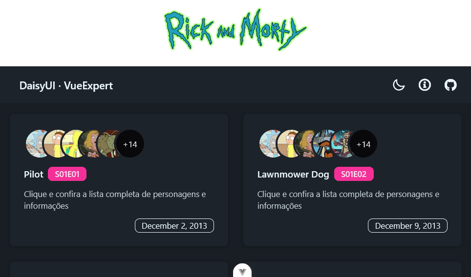

# 🎨 MVP DaisyUI

Projeto desenvolvido durante o [VueExpert](https://cursovuejs.com.br/), utilizando as melhores práticas com Vue 3, Vite, TailwindCSS e DaisyUI.

**[Ver Demo ao Vivo](https://rickmorty-daisyui.vercel.app/)**



## 🚀 Tecnologias

- **[Vue 3](https://vuejs.org/)** - Framework JavaScript progressivo
- **[Vite](https://vite.dev/)** - Build tool ultrarrápido
- **[TailwindCSS](https://tailwindcss.com/)** - Framework CSS utilitário
- **[DaisyUI](https://daisyui.com/)** - Biblioteca de componentes para Tailwind
- **[Pinia Colada](https://pinia-colada.esm.dev/)** - Data fetching inteligente para Vue
- **[ESLint](https://eslint.org/)** - Linter para qualidade de código

## ✨ Características

- ⚡ Hot Module Replacement (HMR) com Vite
- 🎨 Componentes prontos com DaisyUI
- 🎭 [Múltiplos temas disponíveis](https://daisyui.com/theme-generator/)
- 📦 Auto-import de composables Vue (ref, computed, etc)
- 🍹 Data fetching com cache automático via Pinia Colada
- 🔍 ESLint configurado

## 🛠️ Configuração do Ambiente

### IDE Recomendada

- [VS Code](https://code.visualstudio.com/)
- Extensão: [Vue (Official)](https://marketplace.visualstudio.com/items?itemName=Vue.volar)
  - ⚠️ **Importante:** Desabilite a extensão Vetur se estiver instalada

### Ferramentas do Navegador

**Chromium (Chrome, Edge, Brave):**

- [Vue.js devtools](https://chromewebstore.google.com/detail/vuejs-devtools/nhdogjmejiglipccpnnnanhbledajbpd)
- [Custom Object Formatter](http://bit.ly/object-formatters)

**Firefox:**

- [Vue.js devtools](https://addons.mozilla.org/en-US/firefox/addon/vue-js-devtools/)
- [Custom Object Formatter](https://fxdx.dev/firefox-devtools-custom-object-formatters/)

## 📦 Instalação

```bash
# Instalar dependências
npm install
```

## 🏃 Como Executar

```bash
# Desenvolvimento com hot-reload
npm run dev

# Build para produção
npm run build

# Executar linter
npm run lint
```

## ⚙️ Detalhes da Configuração

### 🎨 Configuração do TailwindCSS

O TailwindCSS é necessário para usar o DaisyUI:

```bash
npm install tailwindcss @tailwindcss/vite
```

Em `vite.config.ts`:

```javascript
import { defineConfig } from 'vite'
import tailwindcss from '@tailwindcss/vite'

export default defineConfig({
  plugins: [tailwindcss()]
})
```

No arquivo CSS principal da aplicação:

```css
@import 'tailwindcss';
```

---

### 🌼 Configuração do DaisyUI

```bash
npm i -D daisyui@latest
```

No arquivo CSS principal da aplicação:

```css
@plugin "daisyui";
```

**Vantagens do DaisyUI:**

- Sistema de temas personalizáveis
- Componentes UI prontos para uso
- Sintaxe semântica e intuitiva

---

### ⚡ Auto Import de Composables

Plugin para auto-importar composables do Vue (ref, computed, etc):

```bash
npm install -D unplugin-auto-import
```

Em `vite.config.js`:

```javascript
import AutoImport from 'unplugin-auto-import/vite'

export default defineConfig({
  plugins: [
    AutoImport({
      include: [
        /\.[tj]sx?$/, // .ts, .tsx, .js, .jsx
        /\.vue$/, // .vue
        /\.vue\?vue/, // .vue?vue
        /\.md$/ // .md
      ],
      imports: ['vue']
    })
  ]
})
```

Para evitar erros do ESLint, adicione em `eslint.config.js`:

```javascript
export default defineConfig({
  extends: ['./.eslintrc-auto-import.json']
})
```

---

### 🧩 Auto Import de Componentes

Plugin para auto-importar componentes Vue automaticamente (não precisa fazer import manual):

```bash
npm i unplugin-vue-components -D
```

Em `vite.config.ts`:

```javascript
import Components from 'unplugin-vue-components/vite'

export default defineConfig({
  plugins: [
    Components({
      /* options */
    })
  ]
})
```

**Benefícios:**

- Não precisa importar componentes manualmente
- Descubra e registre componentes automaticamente
- Melhora a experiência de desenvolvimento

---

### 🍹 Pinia Colada - Data Fetching Inteligente

O [Pinia Colada](https://pinia-colada.esm.dev/) é uma biblioteca de data fetching que traz o melhor do React Query/TanStack Query para o ecossistema Vue, integrada nativamente com Pinia.

```bash
npm install @pinia/colada pinia
```

Em `main.js`:

```javascript
import { createApp } from 'vue'
import { createPinia } from 'pinia'
import { PiniaColada } from '@pinia/colada'

const app = createApp(App)
const pinia = createPinia()

app.use(pinia)
app.use(PiniaColada)
app.mount('#app')
```

**Exemplo de uso com composables:**

```javascript
// src/composables/useEpisodes.js
import { useQuery } from '@pinia/colada'
import axios from 'axios'

export function useEpisodes(page) {
  return useQuery({
    key: () => ['episodes', page.value],
    query: async () => {
      const response = await axios.get(`https://api.example.com/episodes?page=${page.value}`)
      return response.data
    },
  })
}

export function useEpisode(id) {
  return useQuery({
    key: () => ['episode', id.value],
    query: async () => {
      const response = await axios.get(`https://api.example.com/episode/${id.value}`)
      return response.data
    },
    enabled: () => !!id.value, // Só executa quando há um ID válido
  })
}
```

**Uso no componente:**

```vue
<script setup>
import { useEpisodes } from '@/composables/useEpisodes'

const page = ref(1)
const { data: episodes, isLoading, error } = useEpisodes(page)
</script>

<template>
  <div v-if="isLoading">Carregando...</div>
  <div v-else-if="error">Erro: {{ error.message }}</div>
  <div v-else>
    <div v-for="episode in episodes.results" :key="episode.id">
      {{ episode.name }}
    </div>
  </div>
</template>
```

**Vantagens:**

- **Cache automático**: Dados são cacheados por chave única, evitando requisições duplicadas
- **Estados reativos prontos**: `isLoading`, `error`, `data` disponíveis automaticamente
- **Revalidação inteligente**: Atualiza dados automaticamente quando necessário
- **Queries condicionais**: Use `enabled` para controlar quando a query deve executar
- **Deduplicação**: Múltiplos componentes usando a mesma query compartilham uma única requisição
- **Integração com Pinia**: Dados persistem no store, disponíveis em toda a aplicação
- **DevTools**: Visualize o estado das queries no Vue DevTools
- **TypeScript**: Tipagem completa out-of-the-box

**Comparação - Antes vs Depois:**

| Antes (manual)                     | Depois (Pinia Colada)           |
| ---------------------------------- | ------------------------------- |
| Gerenciar `loading` manualmente    | `isLoading` automático          |
| Tratar erros em cada componente    | `error` reativo centralizado    |
| Implementar cache próprio          | Cache automático por chave      |
| Refetch manual                     | Revalidação inteligente         |
| Duplicar requisições               | Deduplicação automática         |

## 📖 Documentação Adicional

- [Documentação do Vue 3](https://vuejs.org/)
- [Configuração do Vite](https://vite.dev/config/)
- [Componentes DaisyUI](https://daisyui.com/components/)
- [Utilitários do TailwindCSS](https://tailwindcss.com/docs)
- [Gerador de Temas DaisyUI](https://daisyui.com/theme-generator/)
- [Pinia Colada](https://pinia-colada.esm.dev/)

## 📝 Notas

Este projeto foi desenvolvido como parte de um curso de Vue.js, focando em boas práticas de desenvolvimento e uso de ferramentas modernas do ecossistema Vue.

---

Desenvolvido com ❤️ durante o curso de Vue.js
